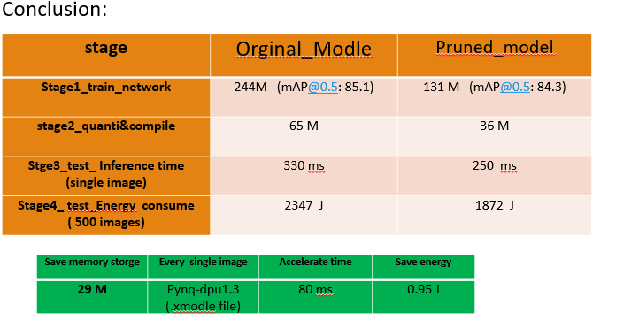

📖 Github
&emsp;&emsp; | &emsp;&emsp;
<a href="https://github.com/chumingqian/Deploy_Yolov4_On_Ultra96_v2/">📚 Docsify</a>

 
 

简体中文
&emsp;&emsp; | &emsp;&emsp;
<a href="https://github.com/chumingqian/Deploy_Yolov4_On_Ultra96_v2/blob/main/README_eng.md">English</a>

 
 

本仓库主要包含以下部分的内容：
------------
* Part1: 调整 yolov4.cfg 网络文件. 
* Part2: 使用vitis -ai 工具对网络进行量化和编译. 
* Part3: 将网络部署到边缘端(ultra_96_v2)上,编写notebook.ipynb 文件，调用pynq-dpu 推理运行网络.  
    
 Note:在部署YOLOV4 网络之前，需要对YOLOV4网络进行剪枝的同学，可以参考(https://github.com/chumingqian/Model_Compression_For_YOLOV4). 这里提供已经训练好的权重文件：https://pan.baidu.com/s/1lL1tPSOKJc4V4eF_SqVoHw 提取码: rvrg，网络文件位于07-yolov4-tutorial/dk_model/ . 注意到，需要先对yolov4.cfg 修改成dpu支持的网络，再对修改后的网络进行剪枝。 

  

Part1:  调整yolov4.cfg 网络.
------------ 
   
   1.0 由于当前pynq-dpu1.2 暂未支持MISH激活函数，且dpu 支持的最大池化的kernel size为8, 故修改yolov4网络的结构, 使修改后的yolov4.cfg 网络能够使用配合使用Xilinx的 vitis-ai 工具进行量化和编译，并在pynq-dpu 上运行.本仓库中对原始网络的 yolov4.cfg 文件做了如下修改.
   
               m1  将MISH激活函数替换成leaky.     
               m2  将SPP Moudle maxpool 由5 ，9，13 替换成 5，5，7; 之后对修改后的网络进行重新微调训练。
         

Part2: 在主机端(ubuntu18.04)上使用 Xilinx 的vitis -ai 1.3.2 工具完成对网络的量化和编译。
------------

   2.0 在Ubuntu18.04 上安装docker， https://docs.docker.com/engine/install/ubuntu/ ，并确认本机的linux user 加入到docker组中，  https://docs.docker.com/engine/install/linux-postinstall/   or reference the  https://www.xilinx.com/html_docs/vitis_ai/1_3/installation.html install the  vitis ai。
   
   2.1 从GitHub上拉取vitis ai的仓库文件：
   
	          git clone --recurse-submodules https://github.com/Xilinx/Vitis-AI  
		  
                  cd Vitis-AI

   2.2 从 docker上拉取预编译好的vitis ai 的安装环境,(若在本地安装请准备好32G 以上的内存用于安装时的编译)。
   
                启动docker 环境中的vitis ai ：	    
	       ./docker_run.sh xilinx/vitis-ai-cpu:latest
		  
	     注意到默认启动最新版本的vitis ai, 如需启动对应的版本，在后面指定对应的序列。
		  	         Vitis AI v1.4	./docker_run.sh xilinx/vitis-ai-cpu:1.4.916
				 Vitis AI v1.3	./docker_run.sh xilinx/vitis-ai-cpu:1.3.411
				 Vitis AI v1.3.1
				 Vitis AI v1.3.2
				 Vitis AI v1.2	./docker_run.sh xilinx/vitis-ai-cpu:1.2.82
             
         
   2.3 在启动vitis ai后， 可以看到vitis ai 当前支持的深度学习框架有Pytorch、Tensorflow、Tensorflow 2 和 Caffe.
   
    由于笔者实现的是Darknet 版本的yolov4, 网络文件为.cfg格式， 故先要对网络文件以及权重文件的格式进行转换，此处介绍两种转换方式由darknet 分别转换成Tensorflow 和 caffe. 之后对caffe 和 Tensorflow 模型进行量化和编译。
    
    对网络模型的量化和编译，具体可参考 vitis ai 中的技术文(https://china.xilinx.com/products/design-tools/vitis/vitis-ai.html)，其中有中文版c_ug1414-vitis-ai.pdf.     
        		

   2.4 Darknet Convert to Tensorflow(conda activate Tensorflow) (for pynq-dpu1.2 ,generate the dpu_model.elf )
		
		STEP1: 网络模型，权重格式转换：		
		python ../keras-YOLOv3-model-set/tools/model_converter/convert.py --yolo4_reorder ../dk_model/yolov4-voc-leaky.cfg ../dk_model/leakcy-v4.weights ../keras_model/v4_voc_leaky.h5
		python ../keras-YOLOv3-model-set/tools/model_converter/keras_to_tensorflow.py --input_model ../keras_model/v4_voc_leaky.h5 --output_model=../tf_model/v4_tf_model.pb
	
	        输入节点和输出节点名称因模型而异，可使用 vai_q_tensorflow 量化器来检查和估算这些节点。请参阅以下代码片段示例：
		$ vai_q_tensorflow inspect --input_frozen_graph=../tf_model/v4_tf_model.pb

               或者通过图可视化获取图的输入和输出名称。 TensorBoard 和 Netron 均可执行此操作。请参阅以下示例， 其中使用的是 Netron：
		$ pip install netron
		$  netron ../tf_model/v4_tf_model.pb

		STEP2:量化步骤：
		vai_q_tensorflow quantize --input_frozen_graph ../tf_model/v4_tf_model.pb --input_fn yolov4_graph_input_keras_fn.calib_input   --output_dir ../chu_v4_quantized --input_nodes image_input --output_nodes conv2d_93/BiasAdd,conv2d_101/BiasAdd,conv2d_109/BiasAdd --input_shapes ?,416,416,3 --calib_iter 30

		STEP3:COMPLIE 编译步骤		
		pynq-dpu1.2 使用以下这个，编译生成的.elf 文件用于 Pynq-dpu1.2 版本：	
		dnnc-dpuv2 --save_kernel --parser tensorflow --frozen_pb ../chu_v4_quantized/deploy_model.pb --dcf dpuPynq_ultra96v2.dcf  --cpu_arch arm64 --output_dir ../chu_v4_compiled --net_name tf_model_v4_416

				
   2.5 darnet  convert to caffe ( conda activate caffe ) (for pynq-dpu1.3, generate the dpu_model.xmodel )	    
		
		STEP1: MODEL CONVERT  TO CAFFE
		python /opt/vitis_ai/conda/envs/vitis-ai-caffe/bin/convert.py ../dk_model/yolov4-voc-leaky.cfg ../dk_model/leakcy-v4.weights  ../dpu1.3.2_caffe_model/v4_leacky.prototxt ../dpu1.3.2_caffe_model/v4_leacky.caffemodel

		STEP2:  MDOEL  QUANTI
		*1.在量化之前，对原始的.prototxt网络拷贝一个副本，在副本中加入校准图片的路径并作如下修改，使用该副本网络进行量化；
		  name: "Darkent2Caffe"
		  #input: "data"
		  #input_dim: 1
		  #input_dim: 3
		  #input_dim: 416
		  #input_dim: 416

		  ####Change input data layer to VOC validation images #####
		  layer {
		    name: "data"
		    type: "ImageData"
		    top: "data"
		    top: "label"
		    include {
		      phase: TRAIN
		    }
		    transform_param {
		      mirror: false
		      yolo_height:416  #change height according to Darknet model
		      yolo_width:416   #change width according to Darknet model
		    }
		    image_data_param {
		      source: "voc/calib.txt"  #list of calibration imaages     
		      root_folder: "images/" #path to calibartion images

		      batch_size: 1
		      shuffle: false
		    }
		  }
		  #####No changes to the below layers##### 
		~~~

		
		*2.并且注意到校准图片的.txt 文档中，实现量化时需要含两列的列表文件，这与tensorflow 的校准文件的txt文档不一样。(对于量化校准，不含标签的校准数据即可足够。但实现需要含2列的图像列表文件。只需将第2列设为随机值或 0 即可)
		*3.注意到校准图片的路径应该是docker 环境下的路径，即路径应该是 workspace 是vitis-ai 为工作空间的， 此时的vitis-ai 可以理解成主机上的home;		
		vai_q_caffe quantize -model ../dpu1.3.2_caffe_model/v4_leacky_quanti.prototxt  -keep_fixed_neuron -calib_iter 3 -weights ../dpu1.3.2_caffe_model/v4_leacky.caffemodel -sigmoided_layers layer133-conv,layer144-conv,layer155-conv -output_dir ../dpu1.3.2_caffe_model/ -method 1 

		STEP3:  MODEL  COMPILE 
		vai_c_caffe --prototxt ../dpu1.3.2_caffe_model/original_model_quanti/deploy.prototxt --caffemodel ../dpu1.3.2_caffe_model/original_model_quanti/deploy.caffemodel --arch ./u96pynq_v2.json --output_dir ../dpu1.3.2_caffe_model/ --net_name dpu1-3-2_v4_voc --options "{'mode':'normal','save_kernel':''}";
		 注意到在ultra_96_v2上,pynq-dpu1.3 中，使用编译生成好的.xmodel 文件运行网络推理时， 如果出现 footprint  not match 的现象，可将u96pynq_v2.json 文件替换成 u96pynq.json，具体可参考：https://forums.xilinx.com/t5/AI-and-Vitis-AI/vitis-ai-1-3-with-ultra96/td-p/1189251 。

Part3: 在边缘端(ultra_96_v2), 使用pynq-dpu1.2 分别测试剪枝前后yolov4网络的推理速度，使用pynq-dpu1.3 分别测试剪枝前后yolov4网络消耗的能量。
------------
       3.1  在SD(32G)卡上烧写PYNQ2.6的镜像， 镜像文件（https://github.com/Xilinx/PYNQ/releases or http://www.pynq.io/board.html) 
       3.2  在ultra_96_v2 上，载入SD卡， 启动板卡。 可以使用MobaXterm连接串口通信， 从本地浏览器中输入192.168.3.1； 在板卡上安装DPU-PYNQ https://github.com/Xilinx/DPU-PYNQ,  如果网速较慢，可以先下载到PC端上， 再从PC机中拖入到板子中对应的路径下。
       3.3  编写用于运行网络推理的notebook.ipynb, 以下为调用DPU 运行网络推理的主体步骤，(其中测试功耗的evaluation.ipynb 在test_energy文件中)。
                      
			* 加载模型(vitis-ai生成的.xmodel or dup_model.elf)：
			  	overlay.load_model(“dpu_model.xmodel”  )
			* 定义dpu对象
			   	dpu = overlay.runner
			* 创建输入和输出Buffer
				output_data = [np.empty(shapeOut, dtype=np.float32, order="C")]
				input_data = [np.empty(shapeIn, dtype=np.float32, order="C")]
			* 进行预测
				job_id = dpu.execute_async(input_data, output_data)
				dpu.wait(job_id)
			* 预测的结果存储在output_data中

Part4: demo.video https://www.bilibili.com/video/BV1AU4y1n7w6/.
------------
展示了当 image input size: 416 *416，从：1.网络的体积，2.网络的推理速度 3.网络消耗的能量，这三个方面来对比剪枝前后的网络的性能:
 
      1  对比剪枝前后网络模型的体积大小.     
      2  在ultra96_v2, pynq-dpu1.2,的环境下载入生成的.elf 文件，运行对应的.ipynb文件.
         2.1 测试剪枝网络模型的推理速度 250 ms.
         2.2 测试未剪枝网络模型的推理速度 330 ms. 
         
      3  在ultra96_v2, pynq-dpu1.3,的环境下载入生成的.xmodel 文件，运行对应的.ipynb文件.
         3.1 测试剪枝网络模型推理10 张images 所消耗的功耗，约为39J.  随后测试推理500 images，所消耗的功耗，约为1872J .
         3.2 测试未剪枝网络模型推理500 images，所消耗的功耗，约为2347J .
    
                           
#####    实验结果如图1所示。

	

致谢:  感谢 XILINX & NICU 共同举办的暑期学校，这是个值得纪念的Summer School, 我们度过了南京疫情和上海“烟花”台风，最终抵达 XILINX_2021 SUMMER SCHOOL的彼岸. 
======  

