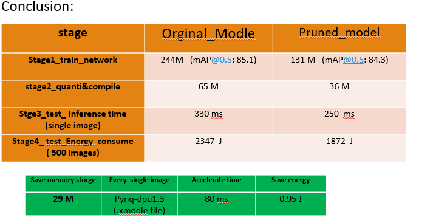

# Deploy_Yolov4_On_Ultra96_v2
Model deployment,  Yolov4,  Xilinx,  Ultra96_v2.

📖 Github
&emsp;&emsp; | &emsp;&emsp;
<a href="https://github.com/chumingqian/Deploy_Yolov4_On_Ultra96_v2/">📚 Docsify</a>

 
 

简体中文
&emsp;&emsp; | &emsp;&emsp;
<a href="https://github.com/chumingqian/Deploy_Yolov4_On_Ultra96_v2/blob/main/README_eng.md">English</a>

 
 

This repository has contain the following part：
------------
* Part1: Modify the network  -- yolov4.cfg. 
* Part2: Use Vitis-ai tool to quantify and compile the yolov4 network. 
* Part3: Deploy the yolov4 to the edge device(ultra_96_v2)上, write the notebook.ipynb to call the pynq-dpu and inference the network. 
    
 Note: Before we deploy the YOLOV4, some friends may want pruning the YOLOV4 network, there is a reference (https://github.com/chumingqian/Model_Compression_For_YOLOV4), we use this method pruning the network and deployed the pruned yolov4 network successfully. Here is weights both for original network and pruned network：https://pan.baidu.com/s/1lL1tPSOKJc4V4eF_SqVoHw ,code: rvrg, And the yolov4.cfg which suit the dpu are locate at 07-yolov4-tutorial/dk_model/ .  Notice that, we need modify the yolov4.cfg firstly so that network can call the dpu module, then we can prune the modified yolov4.cfg.
  

Part1:  Modify yolov4.cfg network.
------------ 
   
   1.0 Due to the current pynq-DPU 1.2 version doesn't support MISH activation, and the maximum kernel size of the maxpooling  is only support to 8*8 ; In this repository, we made two modifications to enable compliance with  the Zynq Ultrascale + DPU, and also the modified the network can be  quantized and compiled by the  Vitis Ai tool. 
   
               m1  The MISH acitvation are  swapped to leakrelu.      
               m2  The SPP Moudle maxpool sizes have been changed from 5 ,9,13 to 5,5,7.
         

Part2: On Host machine(ubuntu18.04) use the Vitis -ai 1.3.2(Xilinx) tool to quantize and compile the network.
------------

   2.0 Install Docker on Ubuntu18.04, if Docker not installed on your machine (https://docs.docker.com/engine/install/ubuntu/ ). Follow the Post installation steps  for Linux ( https://docs.docker.com/engine/install/linux-postinstall/ ) to ensure that your Linux user is in the group Docker. Or you can  reference the  https://www.xilinx.com/html_docs/vitis_ai/1_3/installation.html to install the vitis ai。
   
   2.1 Clone the Vitis ai repository to obtain the examples, reference code, and scripts.
   
	          git clone --recurse-submodules https://github.com/Xilinx/Vitis-AI  
            
            cd Vitis-AI

   2.2 Run the CPU image from the Docker Hub: (Pelese prepare the above 32G Memory, if you want build the CPU image locally.)
   
	          ./docker pull xilinx/vitis-ai-cpu:latest  
		  
	     Notice that default startup version is the latest, you can add the number if you want start the specified version.
       
		  	         Vitis AI v1.4	./docker_run.sh xilinx/vitis-ai-cpu:1.4.916
				         Vitis AI v1.3	./docker_run.sh xilinx/vitis-ai-cpu:1.3.411
				         Vitis AI v1.3.1
				         Vitis AI v1.3.2
				         Vitis AI v1.2	./docker_run.sh xilinx/vitis-ai-cpu:1.2.82
             
         
   2.3  After we startup the vitis ai, we can see that currently  it support the following deep learning frames:Pytorch、Tensorflow、Tensorflow 2 and Caffe .
       In this repository the yolov4 network was trained by the DarkNet, the network file of the modle  is .cfg format, So we both convert the network file's format and weights's format. Here provide the two ways which are convert the Darknet to  Tensorflow and Caffe.
       Then we quantize and compile the converted model, here  is the official  user  guide (https://china.xilinx.com/products/design-tools/vitis/vitis-ai.html), ug1414-vitis-ai.pdf.     
        		

   2.4 Darknet Convert to Tensorflow(conda activate Tensorflow) (For pynq-dpu1.2, generate the dpu_model.elf )
		
		STEP1: convert the model's .cfg file and  model's weights:		
		python ../keras-YOLOv3-model-set/tools/model_converter/convert.py --yolo4_reorder ../dk_model/yolov4-voc-leaky.cfg ../dk_model/leakcy-v4.weights ../keras_model/v4_voc_leaky.h5
		python ../keras-YOLOv3-model-set/tools/model_converter/keras_to_tensorflow.py --input_model ../keras_model/v4_voc_leaky.h5 --output_model=../tf_model/v4_tf_model.pb
	
	   The name of input nodes and output nodes will be different according to the models, use the vai_q_tensorflow  quantizer to check and estimate these nodes: 
     
		$ vai_q_tensorflow inspect --input_frozen_graph=../tf_model/v4_tf_model.pb

		 Otherwise we can visualize the grapth to obtain the name of input nodes and output nodes. 
     TensorBoard and  Netron both support this operation. Here use the Netron：
		$ pip install netron
		$  netron ../tf_model/v4_tf_model.pb

		STEP2: Quantizatin：
		vai_q_tensorflow quantize --input_frozen_graph ../tf_model/v4_tf_model.pb --input_fn yolov4_graph_input_keras_fn.calib_input   --output_dir ../chu_v4_quantized --input_nodes image_input --output_nodes conv2d_93/BiasAdd,conv2d_101/BiasAdd,conv2d_109/BiasAdd --input_shapes ?,416,416,3 --calib_iter 30

		STEP3:COMPLIE 		
		For pynq-dpu1.2 use the following commond, it will generate the .elf  modle.
		dnnc-dpuv2 --save_kernel --parser tensorflow --frozen_pb ../chu_v4_quantized/deploy_model.pb --dcf dpuPynq_ultra96v2.dcf  --cpu_arch arm64 --output_dir ../chu_v4_compiled --net_name tf_model_v4_416

				
   2.5 Darnet  convert to caffe ( conda activate caffe ) (for pynq-dpu1.3, generate the dpu_model.xmodel )	    
		
		STEP1: MODEL CONVERT  TO CAFFE
		python /opt/vitis_ai/conda/envs/vitis-ai-caffe/bin/convert.py ../dk_model/yolov4-voc-leaky.cfg ../dk_model/leakcy-v4.weights  ../dpu1.3.2_caffe_model/v4_leacky.prototxt ../dpu1.3.2_caffe_model/v4_leacky.caffemodel

		STEP2:  MDOEL  Quantization
      *1.Before quantizing the model, we will need to make a minor modifcation to .prototxt file to point to the calibaration images.  Make a new copy of the prototxt file and make the following edits:
            name: "Darkent2Caffe"
            #input: "data"
            #input_dim: 1
            #input_dim: 3
            #input_dim: 416
            #input_dim: 416

            ####Change input data layer to VOC validation images #####
            layer {
              name: "data"
              type: "ImageData"
              top: "data"
              top: "label"
              include {
                phase: TRAIN
              }
              transform_param {
                mirror: false
                yolo_height:416  #change height according to Darknet model
                yolo_width:416   #change width according to Darknet model
              }
              image_data_param {
                source: "voc/calib.txt"  #list of calibration imaages     
                root_folder: "images/" #path to calibartion images

                batch_size: 1
                shuffle: false
              }
            }
            #####No changes to the below layers##### 
    *2. Notice that the calibration images in file.txt, the .txt file needs to be a  two column format to realize the quantization.
    
		*1.在量化之前, 对原始的.prototxt网络拷贝一个副本，在副本中加入校准图片的路径， 使用该副本网络进行量化；
		*2.并且注意到校准图片的.txt 文档中，实现量化时需要含两列的列表文件，这与tensorflow 的校准文件的txt文档不一样。(对于量化校准，不含标签的校准数据即可足够。但实现需要含2列的图像列表文件。只需将第2列设为随机值或 0 即可)
		*3.注意到校准图片的路径应该是docker 环境下的路径，即路径应该是 workspace 是vitis-ai 为工作空间的， 此时的vitis-ai 可以理解成主机上的home;		
		vai_q_caffe quantize -model ../dpu1.3.2_caffe_model/v4_leacky_quanti.prototxt  -keep_fixed_neuron -calib_iter 3 -weights ../dpu1.3.2_caffe_model/v4_leacky.caffemodel -sigmoided_layers layer133-conv,layer144-conv,layer155-conv -output_dir ../dpu1.3.2_caffe_model/ -method 1 

		STEP3:  MODEL  COMPILE 
		vai_c_caffe --prototxt ../dpu1.3.2_caffe_model/original_model_quanti/deploy.prototxt --caffemodel ../dpu1.3.2_caffe_model/original_model_quanti/deploy.caffemodel --arch ./u96pynq_v2.json --output_dir ../dpu1.3.2_caffe_model/ --net_name dpu1-3-2_v4_voc --options "{'mode':'normal','save_kernel':''}";
    
		 注意到在ultra_96_v2上,pynq-dpu1.3 中，使用编译生成好的.xmodel 文件运行网络推理时， 如果出现 footprint  not match 的现象，可将u96pynq_v2.json 文件替换成 u96pynq.json，具体可参考：https://forums.xilinx.com/t5/AI-and-Vitis-AI/vitis-ai-1-3-with-ultra96/td-p/1189251 。

Part3: On the edge device (ultra_96_v2),  
在边缘端(ultra_96_v2), 使用pynq-dpu1.2 分别测试剪枝前后yolov4网络的推理速度，使用pynq-dpu1.3 分别测试剪枝前后yolov4网络消耗的能量。
------------
       3.1  在SD(32G)卡上烧写PYNQ2.6的镜像， 镜像文件（https://github.com/Xilinx/PYNQ/releases or http://www.pynq.io/board.html) 
       3.2  在ultra_96_v2 上，载入SD卡， 启动板卡。 可以使用MobaXterm连接串口通信， 从本地浏览器中输入192.168.3.1； 在板卡上安装DPU-PYNQ https://github.com/Xilinx/DPU-PYNQ,  如果网速较慢，可以先下载到PC端上， 再从PC机中拖入到板子中对应的路径下。
       3.3  编写用于运行网络推理的notebook.ipynb, 以下为调用DPU 运行网络推理的主体步骤，(其中测试功耗的evaluation.ipynb 在test_energy文件中)。
                      
			* 加载模型(vitis-ai生成的.xmodel文件)：
			  	overlay.load_model(“dpu_model.xmodel”  or "dup_model.elf")
			* 定义dpu对象
			   	dpu = overlay.runner
			* 创建输入和输出Buffer
				output_data = [np.empty(shapeOut, dtype=np.float32, order="C")]
				input_data = [np.empty(shapeIn, dtype=np.float32, order="C")]
			* 进行预测
				job_id = dpu.execute_async(input_data, output_data)
				dpu.wait(job_id)
			* 预测的结果存储在output_data中

Part4: demo.video https://www.bilibili.com/video/BV1AU4y1n7w6/.
------------
展示了当 image input size: 416 *416，从：1.网络的体积，2.网络的推理速度 3.网络消耗的能量，这三个方面来对比剪枝前后的网络的性能:
 
      1  对比剪枝前后网络模型的体积大小.     
      2  在ultra96_v2, pynq-dpu1.2,的环境下载入生成的.elf 文件，运行对应的.ipynb文件.
         2.1 测试剪枝网络模型的推理速度 250 ms.
         2.2 测试未剪枝网络模型的推理速度 330 ms. 
         
      3  在ultra96_v2, pynq-dpu1.3,的环境下载入生成的.xmodel 文件，运行对应的.ipynb文件.
         3.1 测试剪枝网络模型推理10 张images 所消耗的功耗，约为39J.  随后测试推理500 images，所消耗的功耗，约为1872J .
         3.2 测试未剪枝网络模型推理500 images，所消耗的功耗，约为2347J .
    
                           
#####    实验结果如图1所示。

	

致谢:  感谢 XILINX & NICU 共同举办的暑期学校，这是个值得纪念的Summer School, 我们度过了南京疫情和上海“烟花”台风，最终抵达 XILINX_2021 SUMMER SCHOOL的彼岸. 
======  

